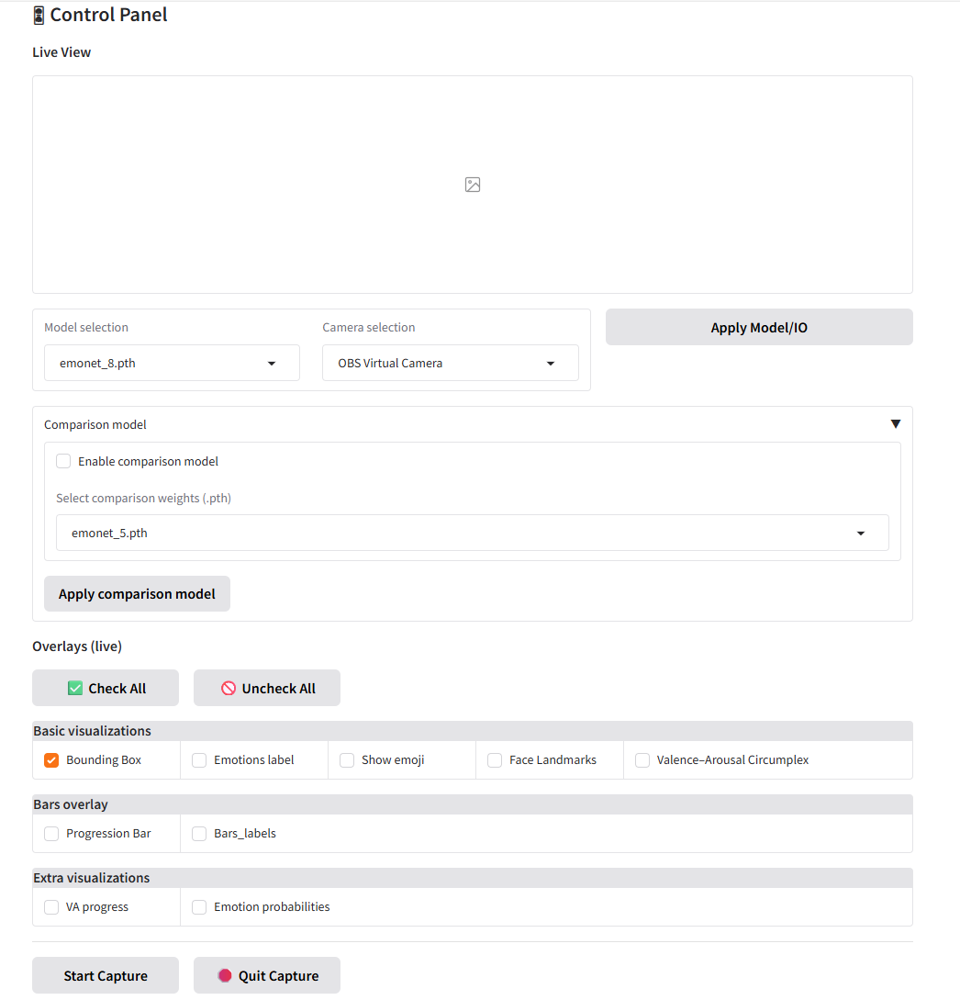

# Real-time Facial Emotion Demo (Webcam + Visualizations)

A demo that runs [EmoNet](https://github.com/face-analysis/emonet) models on live webcam video, displaying overlays (bounding boxes, labels, emojis, landmarks, and VA circumplex) through a **Gradio** control panel. It also supports **side-by-side model comparison** (e.g., 5-class vs 8-class weights) with synchronized visualizations. You can check a showcase video here: [demo](https://www.youtube.com/watch?v=waxnplqpPgs)

---

## Directory Layout

```
.
├── main.py                     # App entry point (launches UI + capture thread)
├── emonet_core.py              # Core capture loop, model loading, drawing pipeline
│
├── functions/
│   ├── ui_gradio.py            # Gradio UI definitions & callbacks
│   ├── config.py               # AppConfig (shared state, start/stop flags & toggles)
│   ├── visualizations.py       # Drawing helpers (bbox, emoji, VA, bars, probabilities)
│   ├── frame_bus.py            # In-memory “bus” to push frames from core → UI
|   ├── paths.py                # A helper fucntion for resovling path issues when building EXE
│   └── __init__.py
│
├── functions/models/           # Models used for the demo (place your custom *.pth here)
├── functions/images/           # Images for the UI and README
│
├── pretrained/                 # Pretrained EmoNet models used as backup if no model is loaded
├── test_videos/                # Contains a short video clip used in the presentation and report
│
├── emonet/                     # Original EmoNet source folder
├── pickles/                    # Original data pickles from the EmoNet repo
├── runs/                       # Original experiment outputs/logs from the EmoNet repo
```

---

## Setup

### Requirements

* **Python 3.12**
* **Windows 11** (developed and tested)
* A working webcam (or a virtual camera such as **OBS Virtual Camera**)

There are two ways to set up the project:

#### Option 1 — Clone with Git (Recommended)
Make sure Git and Git LFS are installed, then run:
```bash
git lfs install
git clone <repo-url>
cd <repo>
git lfs pull
````

#### Option 2 — Download ZIP

If you downloaded the ZIP from GitHub, note that **Git LFS model files are not included**.
You must manually replace the model files inside:

```
/pretrained/
functions/models/
```


### Create Environment & Install

It’s recommended to use a virtual environment to avoid conflicts with existing packages.

```bash
pip install --upgrade pip
pip install -r requirements.txt
```


### Torch Version

Developed on an **RTX 5070 Ti (desktop)** and tested on an **RTX 3070 (laptop)**.
Both used the PyTorch **nightly CUDA 12.8** build:

```bash
pip3 install --pre torch torchvision --index-url https://download.pytorch.org/whl/nightly/cu128
```

If this build doesn’t work on your machine (e.g., different CUDA version, no NVIDIA GPU, or CPU-only), use the official installer to select the right build:
 [Pytorch](https://pytorch.org/get-started/locally/)


### Packaged Version

If you cannot set up the environment or just want to run the program directly,
you can download the packaged executable here:
[FaceApp](https://drive.google.com/file/d/19jtzxHubomG5XBDm8gsR95ZDYIgsvJeG/view?usp=sharing)

Simply run **`FaceApp.exe`** to start the demo.


> 💡 **Tips**
> 
> • Match `torch` and `torchvision` builds (same CUDA/CPU channel).
> 
> • Avoid mixing **conda** and **pip** in the same environment.
> 
> • If your webcam doesn’t open, install **OBS Studio** and use its **Virtual Camera** option.


---

## Models

* Default weights: `./pretrained/emonet_5.pth` and `./pretrained/emonet_8.pth` (used as fallback).
* `./functions/models/emonet_8_FT.pth` is the model we fine-tuned on the [EmoDataset](https://www.kaggle.com/datasets/susmitdas1053/emodataset?select=Emodataset).
* Add custom `.pth` files to `./functions/models/` — they will automatically appear in the **Model selection** dropdown.
* The number of classes (5 or 8) is inferred from the filename (e.g., `*_5.pth` → 5 classes).
  Please name your models correctly.
* The demo only supports models with 5 or 8 classes; other configurations may not work properly.

---

## Run

```bash
python main.py
```
You can also use **`start.bat`** to quickly start the virtual environment if it is located in the same folder.
If no virtual environment is detected, the script will simply open a console in the current directory.
The console should display something like:

```
✅ Program started successfully. Open the UI in your browser: http://127.0.0.1:7860
```

Open the shown URL in your browser.

---

## UI Overview



### Live View

* Displays the processed webcam feed.

### Model / IO

* **Model selection:** choose a `.pth` file from `./functions/models/`.
  If none is selected, the app uses `./pretrained/emonet_8.pth`.
* **Camera selection:** lists available devices (e.g., “USB 2.0 Camera”, “OBS Virtual Camera”).
* **Apply Model/IO:** reloads weights and switches the camera.
  You must click this after changing the model or camera for changes to take effect.
  Both model and camera can be switched during capture.

### Comparison Model

* **Enable comparison model:** enables a second model.
* **Select comparison weights (.pth):** choose from `./functions/models/`.
* **Apply comparison model:** loads the selected model.
  Visualizations that support comparison display **Main** on top and **Compare** on the bottom.

### Overlays (Live)

**Check All / Uncheck All** — quickly toggle all overlay options.

**Basic visualizations**

* **Bounding Box:** Blue rectangle around the detected face.
* **Emotion Label:** Predicted emotion (e.g., *Surprise*).
* **Emoji:** Corresponding emoji shown beside the label.
* **Face Landmarks:** Dense facial landmark points.
* **Valence–Arousal Circumplex:** 2D plot showing (valence, arousal) coordinates.

**Bars overlay**

* **Progress Bar:** VA progression bars with axis titles aligned to the face.
* **Bar Labels:** Semantic labels (e.g., *Positive*, *Neutral*, *Negative*).

**Extra visualizations**

* **VA Progress:** Split panel — top for **Main**, bottom for **Compare**; shows valence and arousal bars in the range [-1, 1].
* **Emotion Probabilities:** Class-probability bars for each model (5 or 8 classes).

**Start Capture** begins the OpenCV loop.
**Quit Capture** stops it and resets the view.

---

## File Descriptions

* **`main.py`** — Initializes logging, launches the Gradio UI thread and the OpenCV capture thread, and connects UI buttons to `AppConfig` actions.
* **`emonet_core.py`** — Core logic: opens the camera, loads models, detects faces, runs inference, and composes the full visualization frame. Publishes frames to the UI via `BUS`.
* **`functions/ui_gradio.py`** — Defines the Gradio interface (dropdowns, buttons, checkboxes) and binds UI elements to the shared configuration state.
* **`functions/config.py`** — Thread-safe state manager (`AppConfig`) that stores camera index, model paths, and start/stop signals.
* **`functions/visualizations.py`** — Drawing utilities for bounding boxes, labels, emojis, and plots.
* **`functions/frame_bus.py`** — Minimal pub/sub system for transferring frames between threads.

Each file is commented for easier understanding if you wish to explore the code in detail.

---

## Usage Tips

* **Performance**

  * A GPU with **CUDA** significantly improves FPS. Install the CUDA-enabled version of PyTorch if available.
  * Use **MJPG** or **YUY2** formats on Windows cameras for higher FPS.
  * Keep resolution reasonable for smooth real-time performance.


## Troubleshooting

* **Camera index out of range / cannot open camera**

  * Choose the correct device in **Camera selection** and click **Apply Model/IO**.
  * Close other applications using the camera (Zoom, Discord, OBS, etc.).


Useful logs are printed to the console during runtime — check them for debugging information.


## Packaging

The project is preconfigured for convenient packaging with **PyInstaller**.  
To create a standalone executable:

1. Adjust any parameters as needed in **`FaceApp.spec`** (e.g., name, icon, data paths).  
2. Run the following command:
   ```bash
   pyinstaller --clean --noconfirm FaceApp.spec
   ```

3. After completion, you’ll find the generated **`.exe`** file inside the `dist/` folder, along with all required dependencies.

This allows the application to run on any Windows system without requiring Python to be installed.


---

## License & Citations

If you use this demo in a publication or project, please cite the original EmoNet paper and follow all related license terms.

> **“Estimation of continuous valence and arousal levels from faces in naturalistic conditions”**
> Antoine Toisoul, Jean Kossaifi, Adrian Bulat, Georgios Tzimiropoulos, and Maja Pantic,
> *Nature Machine Intelligence*, January 2021.


